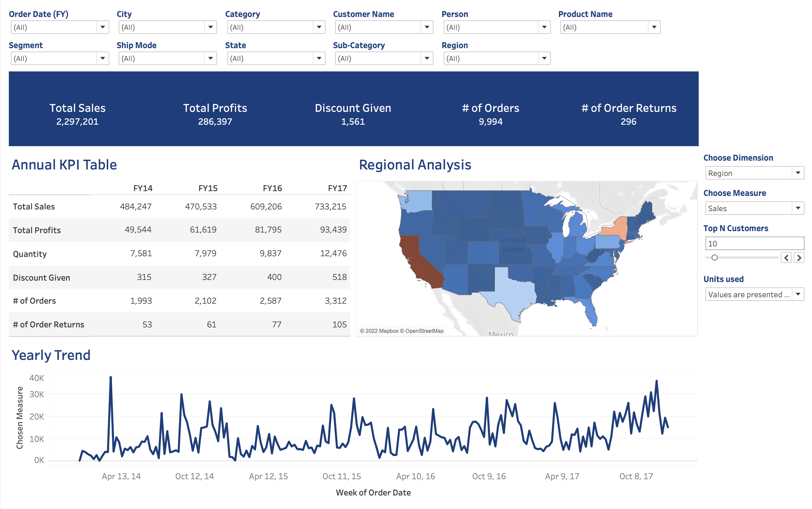

# Caitlyn Le - Data Analytics Portfolio

## Introduction

Hello there, I'm Caitlyn!
 
This repository is created for me to showcase skills, share projects and track my progress in Data Analytics / Data Science related topics using Python Programming Language, SQL and other BI tools such as Tableau and PowerBI  
 

## Projects
In this section, I would briefly describe what each project aims to achieve and what technologies/methods I utilize to answer questions and solve cases

### 1. Visualizing Trends and Building a Linear Regression Model on 80 Types of Cereals
**Code:** ['Visualizing Trends and Building a Linear Regression Model on 80 Types of Cereals'](https://github.com/CaitlynRepo/Python/blob/main/Visualizing%20Trends%20and%20Building%20a%20Linear%20Regression%20Model%20on%2080%20Types%20of%20Cereals/Project_Cereals.ipynb)    
**Description:** The dataset contains nutritional values and information on 80 types of cereal products. The project includes the following steps: data loading, data cleaning and preparations, exploratory data analysis, correlation matrix, linear model regression on predicting ratings for each cereal type
**Skills:** data cleaning, data analysis, EDA, data visualization. \
**Technology:** Python, Pandas, Numpy, Seaborn, Matplotlib.  

### 2. Analysis and Visualization of 12 Months of Sales
**Code:** ['Analysis and Visualization of 12 Months of Sales'](https://github.com/CaitlynRepo/Python/blob/main/Sales%20Data%20Analysis/Sales%20Analysis.ipynb)    
**Description:** The dataset includes 12 different files with thousands of electronics purchases that are broken down into month, product types, costs, purchase address, etc. This project targets to use Python for data cleaning and data analysis to answer business questions \
**Technology:** Python, Pandas, Numpy, Seaborn, Matplotlib.  

### 3. Exploratory Data Analysis on Netflix Dataset
**Code:** ['Exploratory Data Analysis on Netflix Dataset'](https://github.com/CaitlynRepo/Python/blob/main/Data%20Analysis%20Project%20with%20Netlfix%20Dataset/Data%20Analysis%20with%20Netflix%20Dataset.ipynb)    
**Description:** The Netflix Dataset contains all details about TV Shows and Movies on Netflix platform until 2021. The Dataset is collected from Flixable - a third-party Netflix search engine, and is available on Kaggle for free. The Dataset has 7789 rows with 11 columns in total. This project aims to use Python to spot trends and answer questions on Netflix Dataset \
**Technology:** Python, Pandas, Numpy, Seaborn, Matplotlib. 

### 4. Exploratory Data Analysis on Zomato Dataset
**Code:** ['Exploratory Data Analysis on Zomato Dataset'](https://github.com/CaitlynRepo/Python/blob/main/Exploratory%20Data%20Analysis%20Project%20on%20Zomato%20Dataset.ipynb)    
**Description:** Zomato is one of the largest Indian restaurant aggregator and food delivery companies. This project aims to perform EDA on the dataset to answer business questions using Python libraries such as Numpy, Pandas and Matplotlib \
**Technology:** Python, Pandas, Numpy, Seaborn, Matplotlib. 

### 5. House Price Predictions Using Simple Machine Learning Models
**Code:** ['House Price Predictions Using Machine Learning Models'](https://github.com/CaitlynRepo/Python/blob/main/House%20Price%20Prediction%20Project/House_Price_Prediction_ML_Project.ipynb)  
**Description:** The dataset contains 79 independent variables that can affect a house's selling price. This project targets to build simple Regression models using Decision Tree and Random Forest to predict a house with different features for a new input. \
**Technology:** Python, Numpy, Pandas, Decision Tree, Random Forest

### 6. Hedge Fund Management and Stock Analysis
**Code:** ['Hedge Fund Management and Stock Analysis'](https://github.com/CaitlynRepo/Data-Analysis/blob/main/Hedge%20Fund%20Management%20%26%20Stock%20Analysis/Data%20Analysis%20Project%20%20Hedge%20Fund%20Management%20%26%20Stock%20Analysis.ipynb)\
**Description:** Two datasets were used in this project, one was the hedge fund return from EDHEC risk dataset from Jan 1997 to Aug 2020 while the other one includes prices for various stocks from Yahoo Finance between Jan 2000 and Mar 2022. I practiced a variety of finance concepts on the datasets such as calculation of Skewness, Kurtosis, Semideviation and VaR. I also attempted to predict the stock price of Microsoft using ARIMA model.\
**Technology:** Python, Numpy, Pandas, Matplotlib, Statsmodels, Sklearn, ARIMA

### 7. Superstore Tableau Data Visualization
**Viz Snippet:** 

**Description:** The superstore dataset is retail transaction data (or point-of-sales). The dataset is used to conduct data visualizations for insights such as total number order, most bought product category and customer loyalty values. All of the analyses and visualization are done in Tableau.

**Tableau Public:** [LINK](https://public.tableau.com/views/Book1_16629807278160/1_Overview?:language=en-US&:display_count=n&:origin=viz_share_link)

### 8. Online Retail EDA and Cohort Analysis
**Code:** ['Online Retail EDA & Cohort Analysis'](https://github.com/CaitlynRepo/Data-Analysis/blob/main/Online_Retail_EDA_%26_Cohort_Analysis.ipynb)  
**Description:** The dataset is obtained from 'Online Retail UCI' with more than 1 million rows and 7 different columns. I have used Python to answer several key questions for the online business to improve their sales and developed insights based on my cohort analysis from RFM (by quarter from the sales data) \
**Technology:** Python, Numpy, Pandas, Seaborn

### 9. Customer Churn Analysis - Tableau Data Visualization
**Viz Snippet:** 

**Description:** The dataset contains customer data from a Telecom company such as Age, Phone Bill, Unlimited Phone Plans. All of the visualizations are done in Tableau to find out about customer churn rate and how the company can improve on it

**Tableau Public:** [LINK](https://public.tableau.com/app/profile/caitlyn.le/viz/3_1_dashboard_overview_16724248687990/ExecutiveDashboards)

### 10. Analyzing quick insights from MySQL Database - Danny's Dinner Case Study
**Code:** ['Danny's Dinner Case Study'](https://github.com/CaitlynRepo/Data-Analysis/blob/main/SQL/Case%20Study%201%20Danny's%20Dinner/Danny's%20Diner%20Week%201.sql) \
**Description:** This is my solution solving an interesting challenge from Danny Ma as part of his popular 8-weeks-SQL-challenge. The case study requires using CTE windows functions as well as manipulating and joining data in MySQL. Further details about the challenge can be found [HERE](https://8weeksqlchallenge.com/case-study-1/)

### 11. Scaping Singapore's best-sellers books from Amazon using Python BeautifulSoup
**Code:** ['Amazon Best-seller Books'](https://github.com/CaitlynRepo/Data-Analysis/blob/main/SQL/Case%20Study%201%20Danny's%20Dinner/Danny's%20Diner%20Week%201.sql) \
**Description:** This is my solution solving an interesting challenge from Danny Ma as part of his popular 8-weeks-SQL-challenge. The case study requires using CTE windows functions as well as manipulating and joining data in MySQL. Further details about the challenge can be found [HERE](https://8weeksqlchallenge.com/case-study-1/)

